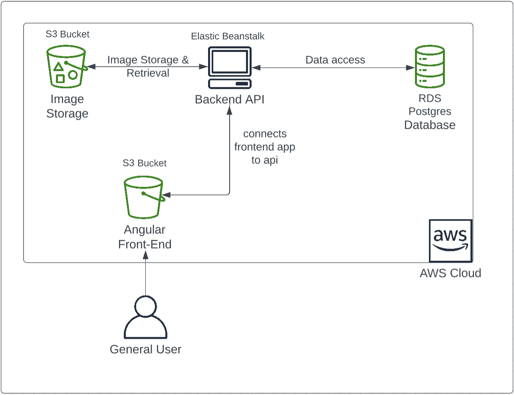

# Infrastrucutre Description

Within this project we have used only Amazon Web Services for the infrastructure.

The required infrastructure image has been appended to this file.

For the full functionality of the project we required: 

# <u>Udagram FrontEnd</u>

* One S3 Bucket for hosting

The frontend was hosted in an S3 bucket and setup to provide read-only public access.

# <u>Udagram BackEnd</u>

* One S3 Bucket for image storage
* One S3 Bucket for the Elastic Beanstalk code (maintained/managed by EB)
* One Elastic Beanstalk Instance within an EB Environment
* One AWS RDS Relational Database with PostgresSQL

The backend was hosted in an EB managed S3 bucket with appropriate access.

# Infrastructure Diagram

