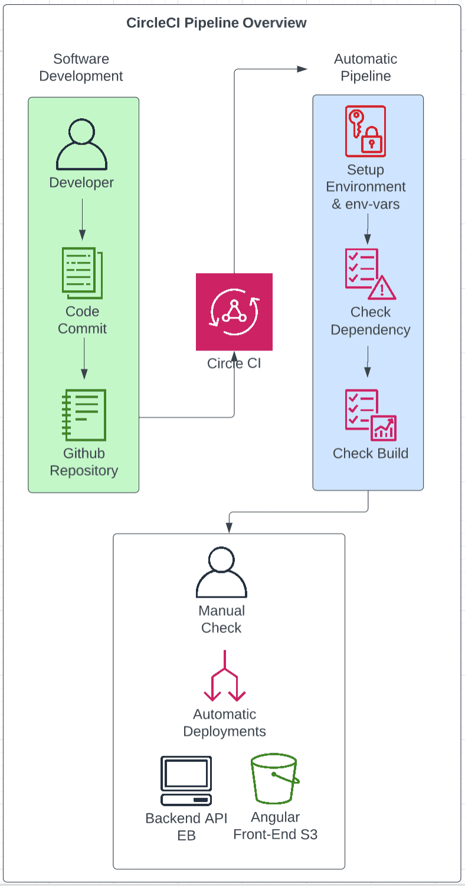

# Pipeline Process

The pipeline process involves the automated Continuous Integration and Continuous Develpemnt process.

## Software Devlopment

This step starts with the code development. 
Once a developer has commited their code and pushed it to the linked github account we move to the next step

## Circle CI

Circle CI detects changes on the github account and triggers a predefined Pipeline execution.

## Pipeline

The automated pipeline execution executes the relevant workflows and specific jobs

### Build

During this phase the software changes are checked to make sure that they integrate with the existing code. 

The following jobs are completed: 

* Spin up environment ( create the working environment )
* Prepare environment variables ( utilises the predefined env-vars )
* Install Node 
* Code Checkout ( copies the code from the github repository )
* Install dependencies FE & BE ( ensures no breaking dependencies )
* Front-End Lint ( Lints the Angular App )
* Front-End Build  ( makes sure the FE can be built with the softwre changes )
* API Build ( checks changes allow the API, BE, to be built )

### Hold

After the Build jobs completes and is successful, there is a 'Hold'. 

Before the pipeline can continue we must manually approve the build from the circleci dashboard. 

Once the build is approved we procede to the deployment phase.

### Deploy

During the deploy the following jobs will be completed: 

* Spin up environment ( create the working environment )
* Prepare environment variables ( utilises the predefined env-vars )
* Install Node 
* Code Checkout ( copies the code from the github repository )
* Install AWS CLI ( this allows aws command scripts to be executed )
* Configure AWS Access Key ID ( provides authentication and authorisation )
* Setting Up Elastic Beanstalk CLI ( provides the EB CLI environment to execute `eb deploy`)
* Deploy ( executes dependency installs, builds and deployments in a single job )

The last step in deployment is the most interesting of all the jobs during the deploy phase.
Explicitly, once the build phase has completed, the deploy phase takes it one step further having already confrimed that the software changes are viable and will be functional.

The deployment is then processed to our infrastructure, namely our S3 Buckets and our Elastic Beanstalk environment. 

## Pipeline Diagram

Within this project we have used only Amazon Web Services for the infrastructure.

The required infrastructure image has been appended to this file.

For the full functionality of the project we required: 

# <u>Udagram FrontEnd</u>

* One S3 Bucket for hosting

The frontend was hosted in an S3 bucket and setup to provide read-only public access.

# <u>Udagram BackEnd</u>